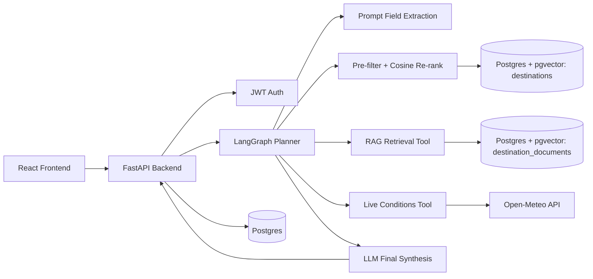

# Smart Travel Planner

An end-to-end smart travel planner that turns a natural-language trip request into:

- an inferred traveler profile
- recommended destinations, ranked by pgvector cosine similarity against that profile
- retrieved destination context from a pgvector-backed RAG store
- live weather conditions
- a synthesized final answer

The system is built with a FastAPI backend, a React frontend, Postgres + pgvector, and a LangGraph
orchestration layer. An earlier version of this pipeline also had an ML travel-style classifier
gating recommendations - it was retired 2026-07-05 in favor of the cosine recommender above, and
fully removed from the repo 2026-07-11 (see the "ML Classifier" section below for the historical
record, and `backend/MODEL_CARD.md` for why).

## What Problem This Solves

Trip planning usually means opening too many tabs:

- inspiration blogs
- weather sites
- maps
- destination guides
- booking pages

The real problem is not lack of information. The real problem is decision fatigue.

This project helps a traveler move from:

> “I have two weeks off in July and around $1,500. I want somewhere warm, not too touristy, and I like hiking. Where should I go, when should I book, and what should I expect?”

to a grounded answer that combines:

- what kind of trip they seem to want
- which destinations match that vibe
- what the app knows about those destinations
- what current weather looks like right now

## Current Status

This repository is **substantially aligned** with the Week 4 Smart Travel Planner brief, but it is not a perfect “all boxes checked” submission yet.

Implemented:

- Structured pre-filter + pgvector cosine destination recommender (an earlier ML classifier
  approach was built, evaluated, and later fully removed - see "ML Classifier" below)
- RAG ingestion, storage, and retrieval
- LangGraph-based multi-tool orchestration
- Postgres persistence for users, runs, tool logs, and embeddings
- JWT auth
- React frontend
- full-stack `docker compose`

Since this section was first written, the following have landed: structured pipeline tracing +
token/cost logging (`app/services/llm_providers/usage_logging.py`, `app/core/logging_config.py`)
and a pytest suite + CI (`backend/tests/`, `.github/workflows/ci.yml`) - see `backend/MODEL_CARD.md`
and this repo's
"Known Gaps" section below for what's real vs. still open. Still missing relative to the brief:

- a fully chat-style, multi-turn frontend (current UI is single-shot request -> response)

This README documents the project **as it exists now**.

## Demo Flow

The current app flow is:

1. User signs up or logs in.
2. User enters a natural-language trip request.
3. LLM-based extraction (provider-agnostic - Gemini by default, Anthropic supported, see
   `backend/README.md`'s "Provider-Agnostic LLM Layer") infers a structured travel profile.
4. A structured SQL pre-filter (budget ceiling, region) narrows the `destinations` corpus, then a
   pgvector cosine re-rank against the prompt's embedding orders the survivors.
5. The RAG tool retrieves destination context from embedded Wikivoyage documents.
6. The live conditions tool checks current weather through Open-Meteo.
7. The same LLM provider synthesizes the final answer.
8. The run is saved to Postgres.

## Architecture



> The SVC travel-style classifier was retired from this path 2026-07-05 (see `backend/README.md`'s
> "Destination Recommendation" section) and fully removed from the repo 2026-07-11 - the trained
> artifact (`artifacts/ml/best_model.joblib`) and `app/services/classifier.py` no longer exist on
> disk, not just unreachable over HTTP. See the "ML Classifier" section below for the historical
> methodology/numbers and `backend/MODEL_CARD.md` for why. The old CSV hand-weighted scorer
> (`app/services/recommendations.py`) was deleted separately, earlier.

## Stack

### Backend

- FastAPI
- SQLAlchemy 2.x async
- asyncpg
- httpx.AsyncClient
- LangGraph
- Pydantic / pydantic-settings
- PyJWT
- pgvector

### Frontend

- React
- TypeScript
- Vite

### Data / ML

- pandas
- scikit-learn
- joblib

### Infra

- Docker Compose
- Postgres 17 + pgvector
- nginx for the frontend container

## Repository Layout

```text
ground-trip/
├── backend/
│   ├── app/
│   │   ├── agent/
│   │   ├── api/
│   │   ├── core/
│   │   ├── db/
│   │   ├── prompts/
│   │   ├── schemas/
│   │   └── services/
│   ├── artifacts/
│   ├── data/
│   └── scripts/
├── frontend/
├── docker-compose.yaml
└── README.md
```

## ML Classifier (historical - fully removed 2026-07-11)

This section is kept as the historical record of a real component that was built, evaluated, and
later removed - not documentation of something currently in the repo. The classifier was retired
from the live recommendation path 2026-07-05 (superseded by the structured pre-filter + pgvector
cosine recommender, see "Destination Recommendation" further down and `backend/MODEL_CARD.md`),
then fully deleted 2026-07-11: the trained artifact (`artifacts/ml/best_model.joblib` and its
sibling metadata/report files), `app/services/classifier.py`, `app/schemas/classifier.py`, and the
agent tool wrapping it are all gone from this checkout. None of the file paths below still exist on
disk; recover them via `git log --diff-filter=D -- backend/app/services/classifier.py` if ever
needed again.

### Labels

The classifier predicts one of six travel styles:

- Adventure
- Relaxation
- Culture
- Budget
- Luxury
- Family

### Dataset

- Source file: `backend/data/travel_destinations_labeled.csv` - removed from the repo 2026-07-11
  along with the rest of the classifier; provenance is git history only now
  (`git log --diff-filter=D -- backend/artifacts/ml/model_metadata.json`), not a file in this checkout
- Size: 200 labeled destinations
- Class balance:
  - Adventure: 34
  - Budget: 34
  - Culture: 33
  - Family: 33
  - Luxury: 33
  - Relaxation: 33

### Labeling Rules

Each destination was labeled according to its **primary travel motive**, not every secondary trait it may also have.

High-level rules used:

- **Adventure**: hiking, trekking, nature-forward, outdoors-first destinations
- **Relaxation**: beach, slow pace, unwind, scenic calm, restorative travel
- **Culture**: heritage, museums, temples, history, architecture, classic city experience
- **Budget**: strong value-for-money orientation and accessible cost profile
- **Luxury**: premium comfort, resort/upscale feel, high-end travel orientation
- **Family**: destinations that strongly support easy, family-oriented travel

The goal was to make labels reflect what a traveler would most likely choose the destination *for*.

### Features

The trained model uses:

- Categorical:
  - `region`
  - `budget_level`
  - `tourism_level`
- Binary:
  - `has_hiking`
  - `has_beach`
- Continuous:
  - `culture_score`
  - `luxury_score`
  - `family_friendly`
  - `nightlife_level`
  - `avg_temp_peak`

### Why These Features

These features were chosen because they capture a mix of:

- practical trip constraints
- activity signals
- destination personality
- traveler expectations

For example:

- `budget_level` helps separate Budget from Luxury signals
- `has_hiking` strongly supports Adventure
- `culture_score` helps distinguish Culture-heavy destinations
- `family_friendly` matters for Family-oriented trips
- `avg_temp_peak` helps preserve climate preference differences

### Training Setup

The workflow lived in `backend/notebook/ml.ipynb` - that notebook was never actually committed to
the repo, only its outputs (the trained artifact and metrics files, also since deleted).

What was done:

- preprocessing inside a scikit-learn pipeline
- 5-fold stratified cross-validation
- fixed random seeds
- results tracked in `backend/artifacts/ml/results.csv` (deleted 2026-07-11)
- winner persisted as `backend/artifacts/ml/best_model.joblib` (deleted 2026-07-11)

### Models Compared

| Model | Accuracy Mean | Accuracy Std | Macro F1 Mean | Macro F1 Std |
|---|---:|---:|---:|---:|
| Logistic Regression | 0.945 | 0.029 | 0.945 | 0.028 |
| Random Forest | 0.960 | 0.041 | 0.960 | 0.039 |
| SVC | 0.965 | 0.037 | 0.965 | 0.037 |
| Tuned Random Forest | 0.960 | 0.041 | 0.960 | 0.039 |

Winner:

- **SVC**
- Accuracy mean: **0.965**
- Macro F1 mean: **0.9646**

### Tuning

At least one model was tuned: Random Forest.

The tuning search explored combinations of:

- `n_estimators`: 200, 300, 500
- `max_depth`: `None`, 6, 10, 14
- `max_features`: `sqrt`, 0.8
- `min_samples_leaf`: 1, 2, 4

This search was visible in `backend/artifacts/ml/results.csv` before that file was deleted
2026-07-11.

### Per-Class Metrics

From `backend/artifacts/ml/classification_report.json` (deleted 2026-07-11 - numbers below are the
last real measurement):

| Class | Precision | Recall | F1 |
|---|---:|---:|---:|
| Adventure | 0.941 | 0.941 | 0.941 |
| Relaxation | 1.000 | 0.909 | 0.952 |
| Culture | 0.971 | 1.000 | 0.985 |
| Budget | 0.943 | 0.971 | 0.957 |
| Luxury | 0.971 | 1.000 | 0.985 |
| Family | 0.970 | 0.970 | 0.970 |

### Artifacts

`backend/artifacts/ml/` used to contain the following, before the whole directory was deleted
2026-07-11 along with the rest of the classifier:

- `results.csv`
- `classification_report.json`
- `model_reports.json`
- `model_metadata.json`
- `best_model.joblib`

## RAG Retrieval System

### Corpus

The current RAG corpus is built from real Wikivoyage pages listed in:

- `backend/data/rag_source_manifest.json`

Current destinations:

- Kyoto
- Tokyo
- Vienna
- Madeira
- Queenstown
- Santorini
- Banff
- Prague
- Paris
- Bali

### Why These Sources

Wikivoyage was used because it gives:

- real destination content
- travel-relevant summaries
- consistent structure across pages
- enough detail for retrieval and synthesis

### Chunking Strategy

Current settings in `backend/app/core/config.py`:

- `rag_chunk_size = 800`
- `rag_chunk_overlap = 120`

Rationale:

- 800 characters is large enough to keep meaningful destination context together
- 120 overlap reduces the chance that useful travel details get split across chunk boundaries
- the corpus is mostly article-style destination content, so moderate overlap is enough without creating excessive duplication

### Retrieval Strategy

The RAG pipeline:

1. fetches real source pages
2. extracts readable article text
3. chunks documents
4. embeds chunks with Voyage AI
5. stores embeddings in Postgres via pgvector
6. embeds the user query
7. runs cosine-similarity search
8. returns top matching chunks

Retrieval runs in-process as part of `POST /agent-runs` (the `retrieve_context` graph node) - the
standalone `POST /tools/retrieve-destination-context` debug route was removed 2026-07-11 (see
"Tool routes" below).

### Retrieval Evaluation

Hand-written evaluation queries live in:

- `backend/data/rag_eval_queries.json`

Evaluation outputs:

- `backend/artifacts/rag/rag_retrieval_eval.json`
- `backend/artifacts/rag/rag_retrieval_eval.csv`

Observed examples:

| Query Theme | Expected Match Present | Top Result |
|---|---|---|
| scenic mountain town + hiking | yes | Banff |
| historic city + temples + heritage | yes | Kyoto |
| romantic European landmarks | yes | Paris |
| island trip + dramatic views | yes | Santorini |
| New Zealand adventure tourism | yes | Queenstown |

One weaker case remains:

- “big city that still works well for flexible family travel” returned Banff instead of Tokyo

So retrieval is generally strong, but not perfect.

## Destination Corpus Ingestion (v2 - production recommender source since 2026-07-05)

Alongside the RAG system above, `backend/app/services/destination_ingestion.py` implements a
richer, Alembic-managed `destinations` table (pgvector, HNSW index) sourced from Wikivoyage,
OpenTripMap POIs, and Numbeo cost-of-living data (with Open-Meteo geocoding standing in for
GeoNames), seeded from a versioned 219-destination manifest
(`backend/data/destination_seed_manifest.json`). It is idempotent (upsert on `name, country`,
content-hash-cached embeddings) and degrades gracefully when a source or the embedding provider is
unavailable, rather than aborting the run. This `destinations` table is what the structured
pre-filter + cosine recommender (see "ML Classifier" above for what it replaced) actually queries;
the separate `destination_documents` RAG table described above is a smaller, distinct corpus (10
Wikivoyage documents) used for context retrieval, not recommendation - the two run side by side in
the same pipeline, not one superseding the other. See `backend/README.md` for schema details,
source rationale, and how to run ingestion from an empty database.

## Agent Design

The agent is built with **LangGraph** and runs a structured pipeline rather than a free-form uncontrolled loop.

### Current Graph Steps

1. Initialize state
2. Extract request fields
3. Recommend destinations (structured pre-filter + pgvector cosine re-rank)
4. Retrieve destination context
5. Fetch live conditions
6. Synthesize final answer

### Tools

Current tool set used by the trip-planner graph:

- `destination_recommender`
- `destination_context_retriever`
- `live_conditions`

The `travel_style_classifier` tool that used to be registered here (unreachable by the graph even
before this) was removed along with the rest of the classifier 2026-07-11 - it's no longer in the
tool registry at all, not just uncalled.

### Tool Validation

Every tool uses a Pydantic input schema before execution.

Examples:

- `DestinationRecommendationRequest`
- `RagRetrievalRequest`
- `LiveConditionsRequest`

### Tool Allowlist

The LangGraph planner uses the registered tool registry only. Tools are not executed by arbitrary name strings from the model.

## Provider-Agnostic LLM Layer

The project routes all LLM work through a vendor-agnostic `LLMProvider` interface
(`app/services/llm_providers/`) - see `backend/README.md`'s "Provider-Agnostic LLM Layer" for the
full design and why it exists (an Anthropic billing block, at the time). `LLM_PROVIDER` (default
`gemini`) selects the vendor; `anthropic` remains fully implemented and selectable, just not the
default.

There used to be separate fast/strong model tiers per provider; those were removed 2026-07-06 in
favor of one single configured model per provider (`settings.gemini.model` /
`settings.anthropic.model`, currently `gemini-3.1-flash-lite`) used for every call site -
extraction, synthesis, and offline cluster naming alike. See `backend/MODEL_CARD.md`'s "LLM usage"
component for current model name, live-verified cost/latency numbers, and known limitations.

Token usage logging and per-call cost estimation are implemented
(`app/services/llm_providers/usage_logging.py`) - this used to be an open gap, closed 2026-07-06.

## Persistence

The system uses one Postgres database for:

- users
- agent runs
- tool logs
- destination embeddings
- recommendation slates + anonymous thumbs up/down feedback

### Current Tables

- `users`
- `agent_runs`
- `tool_logs`
- `destination_documents`
- `recommendations` - the full ranked slate per run, with a feature snapshot per candidate
- `feedback` - anonymous, session-uuid-keyed thumbs up/down on a recommendation

At minimum, persisted data includes:

- who asked
- what they asked
- what the agent answered
- which tools fired
- when the run happened
- which destinations were recommended, in what order, with what score
- whether an anonymous session rated a given recommendation useful

## Auth

The backend currently supports:

- `POST /auth/signup`
- `POST /auth/login`
- `GET /auth/me`

Passwords are hashed and the API uses JWT bearer auth for protected routes.

## Frontend

The frontend is a React + Vite app with:

- separate auth screens
  - `/login`
  - `/signup`
- planner screen
  - `/app`
- result display
- tool log visibility

The frontend currently behaves more like a structured planner UI than a true streaming chat interface.

## Docker

The stack can now be started with:

```powershell
docker compose up --build
```

Current services:

- `db`
- `backend`
- `frontend`

Ports:

- frontend: `http://localhost:5173`
- backend: `http://localhost:8000`
- db: `localhost:5432`

Persistence:

- Postgres uses a named volume: `postgres_data`

## API Surface

Current notable routes:

### Auth

- `POST /auth/signup`
- `POST /auth/login`
- `GET /auth/me`

### Core agent flow

- `POST /agent-runs`
- `POST /feedback`

### Health

- `GET /health`

The debug `/tools/*` routes previously listed here (`classify-travel-style`,
`recommend-destinations`, `retrieve-destination-context`, `get-live-conditions`, `test-claude`,
`test-extraction`, `test-discord-webhook`, `anthropic-models`) were removed 2026-07-11 - none were
called by the frontend, API-tested, or documented beyond this list. The services and tools they
wrapped are unaffected; they still run in-process as part of `POST /agent-runs`.

## Running Locally

### Backend

From `backend/`:

```powershell
uv run uvicorn main:app --reload
```

### Frontend

From `frontend/`:

```powershell
npm install
npm run dev
```

### Full stack

From repo root:

```powershell
docker compose up --build
```

## Environment

Create `backend/.env` from `backend/.env.example`.

Important keys include:

- `DATABASE_URL`
- `JWT_SECRET_KEY`
- `VOYAGE_API_KEY`
- `ANTHROPIC_API_KEY`
- `FRONTEND_ORIGIN`

## Engineering Choices

The project follows the engineering direction of the brief in several important ways:

- async FastAPI routes
- async SQLAlchemy session
- shared `httpx.AsyncClient`
- lifespan-managed resources
- typed settings with `pydantic-settings`
- dependency injection through FastAPI dependencies
- Pydantic schemas at external boundaries
- modular structure instead of a monolithic `main.py`

## Known Gaps

Updated 2026-07-08 - several items below were closed this session; see `backend/MODEL_CARD.md` and
`backend/README.md` for the full write-up on each.

**Closed:**
- ~~LangSmith or equivalent end-to-end tracing~~ - real structured Python `logging` instead (no new
  external account needed), covering the LLM provider layer and the full trip-planner pipeline.
- ~~token usage / cost accounting~~ - per-call token counts + an estimated dollar cost, logged from
  the LLM provider layer.
- ~~tests and CI~~ - `backend/tests/` (pytest + pytest-asyncio) and `.github/workflows/ci.yml` now
  exist.

Still missing:

- Real user feedback: the `feedback` table is empty, so the LightGBM ranker is still trained on a
  synthetic cold-start bootstrap, not real preference data. The retrain path exists
  (`scripts/train_ranker.py retrain`) but has never fired for real.
- The clustering pipeline's weighted travel-style tags (`destinations.tags`) are real and applied,
  but nothing in the live agent graph sets `required_tags` from them yet - the recommender's own
  tag-threshold filter is correct and tested, just unexercised in production traffic.
- A final polished README extra: a real trace screenshot.

## Deliverable Honesty

This repository demonstrates a strong working prototype of the Smart Travel Planner:

- the AI path works
- the engineering structure is real
- the system runs end to end

But it is still fair to call it:

- **feature-complete enough to demo**
- **not fully polished enough to claim every line of the brief is finished**

That distinction matters, and this README is intentionally written to reflect the current truth of the project.
