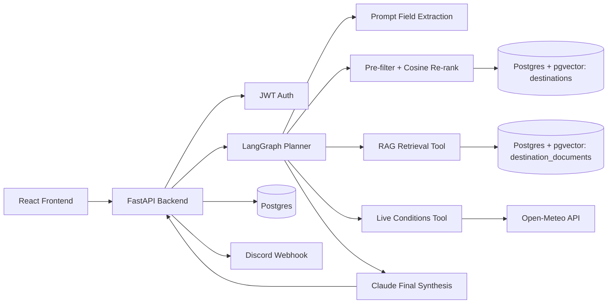

# Smart Travel Assistant

An end-to-end smart travel planner that turns a natural-language trip request into:

- an inferred traveler profile
- a predicted travel style
- recommended destinations
- retrieved destination context from a pgvector-backed RAG store
- live weather conditions
- a synthesized final answer
- a Discord webhook delivery

The system is built with a FastAPI backend, a React frontend, Postgres + pgvector, an ML travel-style classifier, and a LangGraph orchestration layer.

## What Problem This Solves

Trip planning usually means opening too many tabs:

- inspiration blogs
- weather sites
- maps
- destination guides
- booking pages

The real problem is not lack of information. The real problem is decision fatigue.

This project helps a traveler move from:

> “I have two weeks off in July and around $1,500. I want somewhere warm, not too touristy, and I like hiking. Where should I go, when should I book, and what should I expect?”

to a grounded answer that combines:

- what kind of trip they seem to want
- which destinations match that vibe
- what the app knows about those destinations
- what current weather looks like right now

## Current Status

This repository is **substantially aligned** with the Week 4 Smart Travel Planner brief, but it is not a perfect “all boxes checked” submission yet.

Implemented:

- ML classifier with saved model artifacts
- RAG ingestion, storage, and retrieval
- LangGraph-based multi-tool orchestration
- Postgres persistence for users, runs, tool logs, and embeddings
- JWT auth
- React frontend
- Discord webhook delivery
- full-stack `docker compose`

Still missing or incomplete relative to the brief:

- LangSmith or equivalent end-to-end trace screenshot
- token usage logging and per-query cost breakdown
- webhook retry with backoff
- formal automated tests / CI coverage
- a fully chat-style frontend

This README documents the project **as it exists now**.

## Demo Flow

The current app flow is:

1. User signs up or logs in.
2. User enters a natural-language trip request.
3. Claude-based extraction infers a structured travel profile.
4. A structured SQL pre-filter (budget ceiling, region) narrows the `destinations` corpus, then a
   pgvector cosine re-rank against the prompt's embedding orders the survivors.
5. The RAG tool retrieves destination context from embedded Wikivoyage documents.
6. The live conditions tool checks current weather through Open-Meteo.
7. Claude synthesizes the final answer.
8. The run is saved to Postgres and posted to Discord.

## Architecture



> The SVC travel-style classifier (`artifacts/ml/best_model.joblib`) and the CSV hand-weighted
> scorer (`app/services/recommendations.py`) have been retired from this path (see
> `backend/README.md`'s "Destination Recommendation" section). Both files are still on disk and the
> classifier is still reachable standalone via `POST /tools/classify-travel-style`, but neither is
> called by the trip-planner graph anymore.

## Stack

### Backend

- FastAPI
- SQLAlchemy 2.x async
- asyncpg
- httpx.AsyncClient
- LangGraph
- Pydantic / pydantic-settings
- PyJWT
- pgvector

### Frontend

- React
- TypeScript
- Vite

### Data / ML

- pandas
- scikit-learn
- joblib

### Infra

- Docker Compose
- Postgres 17 + pgvector
- nginx for the frontend container

## Repository Layout

```text
smart_travel_assistant/
├── backend/
│   ├── app/
│   │   ├── agent/
│   │   ├── api/
│   │   ├── core/
│   │   ├── db/
│   │   ├── prompts/
│   │   ├── schemas/
│   │   └── services/
│   ├── artifacts/
│   ├── data/
│   ├── notebook/
│   └── scripts/
├── frontend/
├── db/
│   └── init/
├── docker-compose.yaml
└── README.md
```

## ML Classifier

### Labels

The classifier predicts one of six travel styles:

- Adventure
- Relaxation
- Culture
- Budget
- Luxury
- Family

### Dataset

- Source file: `backend/data/travel_destinations_labeled.csv`
- Size: 200 labeled destinations
- Class balance:
  - Adventure: 34
  - Budget: 34
  - Culture: 33
  - Family: 33
  - Luxury: 33
  - Relaxation: 33

### Labeling Rules

Each destination was labeled according to its **primary travel motive**, not every secondary trait it may also have.

High-level rules used:

- **Adventure**: hiking, trekking, nature-forward, outdoors-first destinations
- **Relaxation**: beach, slow pace, unwind, scenic calm, restorative travel
- **Culture**: heritage, museums, temples, history, architecture, classic city experience
- **Budget**: strong value-for-money orientation and accessible cost profile
- **Luxury**: premium comfort, resort/upscale feel, high-end travel orientation
- **Family**: destinations that strongly support easy, family-oriented travel

The goal was to make labels reflect what a traveler would most likely choose the destination *for*.

### Features

The trained model uses:

- Categorical:
  - `region`
  - `budget_level`
  - `tourism_level`
- Binary:
  - `has_hiking`
  - `has_beach`
- Continuous:
  - `culture_score`
  - `luxury_score`
  - `family_friendly`
  - `nightlife_level`
  - `avg_temp_peak`

### Why These Features

These features were chosen because they capture a mix of:

- practical trip constraints
- activity signals
- destination personality
- traveler expectations

For example:

- `budget_level` helps separate Budget from Luxury signals
- `has_hiking` strongly supports Adventure
- `culture_score` helps distinguish Culture-heavy destinations
- `family_friendly` matters for Family-oriented trips
- `avg_temp_peak` helps preserve climate preference differences

### Training Setup

The workflow lives in `backend/notebook/ml.ipynb`.

What was done:

- preprocessing inside a scikit-learn pipeline
- 5-fold stratified cross-validation
- fixed random seeds
- results tracked in `backend/artifacts/ml/results.csv`
- winner persisted as `backend/artifacts/ml/best_model.joblib`

### Models Compared

| Model | Accuracy Mean | Accuracy Std | Macro F1 Mean | Macro F1 Std |
|---|---:|---:|---:|---:|
| Logistic Regression | 0.945 | 0.029 | 0.945 | 0.028 |
| Random Forest | 0.960 | 0.041 | 0.960 | 0.039 |
| SVC | 0.965 | 0.037 | 0.965 | 0.037 |
| Tuned Random Forest | 0.960 | 0.041 | 0.960 | 0.039 |

Winner:

- **SVC**
- Accuracy mean: **0.965**
- Macro F1 mean: **0.9646**

### Tuning

At least one model was tuned: Random Forest.

The tuning search explored combinations of:

- `n_estimators`: 200, 300, 500
- `max_depth`: `None`, 6, 10, 14
- `max_features`: `sqrt`, 0.8
- `min_samples_leaf`: 1, 2, 4

This search is visible in `backend/artifacts/ml/results.csv`.

### Per-Class Metrics

From `backend/artifacts/ml/classification_report.json`:

| Class | Precision | Recall | F1 |
|---|---:|---:|---:|
| Adventure | 0.941 | 0.941 | 0.941 |
| Relaxation | 1.000 | 0.909 | 0.952 |
| Culture | 0.971 | 1.000 | 0.985 |
| Budget | 0.943 | 0.971 | 0.957 |
| Luxury | 0.971 | 1.000 | 0.985 |
| Family | 0.970 | 0.970 | 0.970 |

### Artifacts

`backend/artifacts/ml/` contains:

- `results.csv`
- `classification_report.json`
- `model_reports.json`
- `model_metadata.json`
- `best_model.joblib`

## RAG Retrieval System

### Corpus

The current RAG corpus is built from real Wikivoyage pages listed in:

- `backend/data/rag_source_manifest.json`

Current destinations:

- Kyoto
- Tokyo
- Vienna
- Madeira
- Queenstown
- Santorini
- Banff
- Prague
- Paris
- Bali

### Why These Sources

Wikivoyage was used because it gives:

- real destination content
- travel-relevant summaries
- consistent structure across pages
- enough detail for retrieval and synthesis

### Chunking Strategy

Current settings in `backend/app/core/config.py`:

- `rag_chunk_size = 800`
- `rag_chunk_overlap = 120`

Rationale:

- 800 characters is large enough to keep meaningful destination context together
- 120 overlap reduces the chance that useful travel details get split across chunk boundaries
- the corpus is mostly article-style destination content, so moderate overlap is enough without creating excessive duplication

### Retrieval Strategy

The RAG pipeline:

1. fetches real source pages
2. extracts readable article text
3. chunks documents
4. embeds chunks with Voyage AI
5. stores embeddings in Postgres via pgvector
6. embeds the user query
7. runs cosine-similarity search
8. returns top matching chunks

The retrieval route is:

- `POST /tools/retrieve-destination-context`

### Retrieval Evaluation

Hand-written evaluation queries live in:

- `backend/data/rag_eval_queries.json`

Evaluation outputs:

- `backend/artifacts/rag/rag_retrieval_eval.json`
- `backend/artifacts/rag/rag_retrieval_eval.csv`

Observed examples:

| Query Theme | Expected Match Present | Top Result |
|---|---|---|
| scenic mountain town + hiking | yes | Banff |
| historic city + temples + heritage | yes | Kyoto |
| romantic European landmarks | yes | Paris |
| island trip + dramatic views | yes | Santorini |
| New Zealand adventure tourism | yes | Queenstown |

One weaker case remains:

- “big city that still works well for flexible family travel” returned Banff instead of Tokyo

So retrieval is generally strong, but not perfect.

## Destination Corpus Ingestion (v2, not yet wired into the agent)

Alongside the RAG system above, `backend/app/services/destination_ingestion.py` implements a
richer, Alembic-managed `destinations` table (pgvector, HNSW index) sourced from Wikivoyage,
OpenTripMap POIs, and Numbeo cost-of-living data (with Open-Meteo geocoding standing in for
GeoNames), seeded from a versioned 219-destination manifest
(`backend/data/destination_seed_manifest.json`). It is idempotent (upsert on `name, country`,
content-hash-cached embeddings) and degrades gracefully when a source or the embedding provider is
unavailable, rather than aborting the run. The existing classifier, `travel_destinations_labeled.csv`,
and `destination_documents` RAG table are untouched - this is a parallel corpus, not a replacement
yet. See `backend/README.md` for schema details, source rationale, and how to run ingestion from an
empty database.

## Agent Design

The agent is built with **LangGraph** and runs a structured pipeline rather than a free-form uncontrolled loop.

### Current Graph Steps

1. Initialize state
2. Extract request fields
3. Recommend destinations (structured pre-filter + pgvector cosine re-rank)
4. Retrieve destination context
5. Fetch live conditions
6. Synthesize final answer

### Tools

Current tool set used by the trip-planner graph:

- `destination_recommender`
- `destination_context_retriever`
- `live_conditions`

`travel_style_classifier` remains registered and is reachable standalone via
`POST /tools/classify-travel-style`, but the graph no longer calls it.

### Tool Validation

Every tool uses a Pydantic input schema before execution.

Examples:

- `TravelStylePredictionRequest`
- `DestinationRecommendationRequest`
- `RagRetrievalRequest`
- `LiveConditionsRequest`

### Tool Allowlist

The LangGraph planner uses the registered tool registry only. Tools are not executed by arbitrary name strings from the model.

## Two-Model Strategy

The project routes different LLM work to different model tiers.

Current strategy:

- **Fast model** (`anthropic_fast_model`)
  - used for extraction / mechanical work
- **Strong model** (`anthropic_strong_model`)
  - used for final synthesis when the task is longer, richer, or noisier

This matches the spirit of the brief.

### Current Gap

What is **not** yet implemented:

- token usage logging per step
- exact per-query cost breakdown

So model routing is implemented, but cost accounting is still missing.

## Persistence

The system uses one Postgres database for:

- users
- agent runs
- tool logs
- destination embeddings

### Current Tables

- `users`
- `agent_runs`
- `tool_logs`
- `destination_documents`

At minimum, persisted data includes:

- who asked
- what they asked
- what the agent answered
- which tools fired
- when the run happened

## Auth

The backend currently supports:

- `POST /auth/signup`
- `POST /auth/login`
- `GET /auth/me`

Passwords are hashed and the API uses JWT bearer auth for protected routes.

## Frontend

The frontend is a React + Vite app with:

- separate auth screens
  - `/login`
  - `/signup`
- planner screen
  - `/app`
- result display
- tool log visibility

The frontend currently behaves more like a structured planner UI than a true streaming chat interface.

## Webhook Delivery

The app currently posts finished trip plans to Discord via webhook.

Design goal already met:

- webhook failure does **not** break the user-facing response

Current gap relative to the brief:

- retry with backoff is not yet implemented

## Docker

The stack can now be started with:

```powershell
docker compose up --build
```

Current services:

- `db`
- `backend`
- `frontend`

Ports:

- frontend: `http://localhost:5173`
- backend: `http://localhost:8000`
- db: `localhost:5432`

Persistence:

- Postgres uses a named volume: `postgres_data`

## API Surface

Current notable routes:

### Auth

- `POST /auth/signup`
- `POST /auth/login`
- `GET /auth/me`

### Core agent flow

- `POST /agent-runs`

### Tool routes

- `POST /tools/classify-travel-style`
- `POST /tools/recommend-destinations`
- `POST /tools/retrieve-destination-context`
- `POST /tools/get-live-conditions`
- `POST /tools/test-claude`
- `POST /tools/test-extraction`
- `POST /tools/test-discord-webhook`
- `GET /tools/anthropic-models`

## Running Locally

### Backend

From `backend/`:

```powershell
uv run uvicorn main:app --reload
```

### Frontend

From `frontend/`:

```powershell
npm install
npm run dev
```

### Full stack

From repo root:

```powershell
docker compose up --build
```

## Environment

Create `backend/.env` from `backend/.env.example`.

Important keys include:

- `DATABASE_URL`
- `JWT_SECRET_KEY`
- `VOYAGE_API_KEY`
- `ANTHROPIC_API_KEY`
- `DISCORD_WEBHOOK_URL`
- `FRONTEND_ORIGIN`

## Engineering Choices

The project follows the engineering direction of the brief in several important ways:

- async FastAPI routes
- async SQLAlchemy session
- shared `httpx.AsyncClient`
- lifespan-managed resources
- typed settings with `pydantic-settings`
- dependency injection through FastAPI dependencies
- Pydantic schemas at external boundaries
- modular structure instead of a monolithic `main.py`

## Known Gaps

To be fully brief-complete, the main missing pieces are:

- LangSmith or equivalent end-to-end tracing
- token usage / cost accounting
- webhook retry with backoff
- tests and CI
- final polished README extras like a real trace screenshot

## Deliverable Honesty

This repository demonstrates a strong working prototype of the Smart Travel Planner:

- the AI path works
- the engineering structure is real
- the system runs end to end

But it is still fair to call it:

- **feature-complete enough to demo**
- **not fully polished enough to claim every line of the brief is finished**

That distinction matters, and this README is intentionally written to reflect the current truth of the project.
